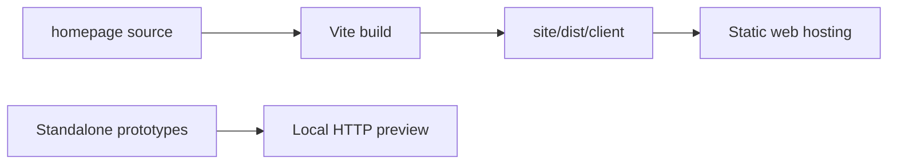

# Respire Website

Source for the Respire product website, localized content, and static design prototypes. This repository contains no memory engine, CLI, or synchronization server implementation.



## Repository map

| Directory | Purpose |
| --- | --- |
| `homepage/` | Current React website: English at `/`, Chinese at `/zh/` |
| `homepage/public/preview/` | Standalone client demonstrations |
| `homepage/prototypes/multilingual-v2/` | Compact six-language static prototype |
| `homepage/prototypes/lumina-v3/` | Alternative six-language static prototype |
| `site/` | Separate Sites/Vinext starter and its platform tooling |
| `site/dist/client/` | Generated current-website assets |

## Develop and verify

```sh
cd homepage
npm ci
npm test
npm run build:preview
npm run build
```

The build writes localized entry pages and shared assets to `site/dist/client/`. Keep that distribution directory aligned with source changes. See [homepage documentation](homepage/README.md) for translation and preview workflows.

## Boundaries

| Component | Connection |
| --- | --- |
| [CLI](https://github.com/risense-ai/respire-cli) | Commands and installation instructions |
| [Documentation](https://github.com/risense-ai/respire-docs) | Architecture and user documentation |
| [Server](https://github.com/risense-ai/respire-server) | Optional website deployment integration and dashboard routes |
| Core | No source access or build dependency |

The user dashboard points to the configured `https://dash.rsrs.rs` destination. Website build checks do not verify account services, encryption, installer execution, or benchmark claims. Release and deployment workflows are separate from local validation.

## Configured destinations

| Service | URL |
| --- | --- |
| Website | `https://rsrs.rs` |
| User dashboard | `https://dash.rsrs.rs` |
| Administration | `https://admin.rsrs.rs` |
| API | `https://api.rsrs.rs` |

These owner-supplied destinations are configuration, not evidence of DNS, HTTPS or deployed service availability.

## CLI package

The npm launcher provides the `rsrs` command.

```sh
npm i -g @rsrsai/cli
# or
pnpm add -g @rsrsai/cli
rsrs --help
```
