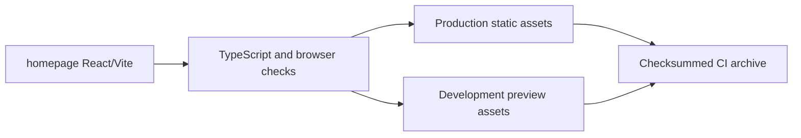

# Respire Website

The Respire product website: local memory, useful context and continuity across AI tools.

| Destination | URL |
| --- | --- |
| Website | https://rsrs.rs |
| Account dashboard | https://dash.rsrs.rs |
| Administration | https://admin.rsrs.rs |
| API | https://api.rsrs.rs |



## Build

```sh
cd homepage
npm ci
npm run check
npm test
npm run build
npm run build:dev
```

Production files are written to `site/dist/client/`; preview files to `site/dist/preview/`. English is the default language, with Chinese at `/zh/`. The preview uses `/preview/` and links to the development dashboard and administration routes.

See [homepage documentation](homepage/README.md) for browser checks, motion controls and configuration. Preserve [third-party notices](THIRD_PARTY_NOTICES.md) and the vendored CSS license with the source.

## CLI

```sh
npm i -g @rsrsai/cli
# or
pnpm add -g @rsrsai/cli
rsrs doctor
rsrs --help
rsrs recall "query" --titles --json
```

The website workflow builds and verifies both distributions, records the source revision and uploads checksummed archives. A stable tag publishes release assets; deployment is separate.
