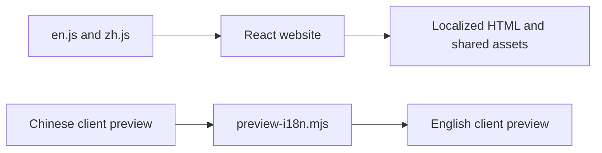

# Respire Homepage

Current React/Vite website. English is served at `/`; Chinese is served at `/zh/`. The URL selects the language. Browser preferences may show a language hint but never force a redirect.



## Source map

| Path | Responsibility |
| --- | --- |
| `src/App.jsx` | Product page, public links, and preview bridge |
| `src/i18n/en.js`, `zh.js` | Matching translation keys |
| `src/i18n/index.js` | URL language resolution and dictionary lookup |
| `scripts/preview-i18n.mjs` | Translate the standalone client snapshot and check script syntax |
| `i18n/preview.en.json` | Decoded Chinese-to-English preview strings |
| `public/preview/` | Client demonstration files copied into the build |
| `tests/i18n.test.mjs` | Existing language and preview coverage checks |
| `vite.config.mjs` | English and Chinese entry generation |

## Commands

```sh
npm ci
npm run dev
npm test
npm run build:preview
npm run build
```

The output is `../site/dist/client/`: root English HTML, `zh/index.html`, shared `assets/`, and client previews. Regenerate the output after source changes.

For preview text changes, edit `i18n/preview.en.json` and run `npm run build:preview`. `npm run build:preview -- --extract` lists untranslated source strings in a temporary file. The generator checks embedded JavaScript syntax and rejects untranslated Chinese strings in the English result. The embedded preview remains a demonstration, not an installed client or an authenticated service.

## Add a locale

Keep dictionary keys aligned with English, update language resolution and the Vite locale/head configuration, and provide a matching client preview. Run the existing tests and inspect the localized output before publishing.

## Prototypes

| Prototype | Scope |
| --- | --- |
| [Multilingual V2](prototypes/multilingual-v2/README.md) | Compact static layout with six-language text |
| [Lumina V3](prototypes/lumina-v3/README.md) | Alternative static visual layout with the same language set |

Both prototypes have their own templates and Python build scripts. They do not participate in the React website build.

## Configured destinations

| Service | URL |
| --- | --- |
| Website | `https://rsrs.rs` |
| User dashboard | `https://dash.rsrs.rs` |
| Administration | `https://admin.rsrs.rs` |
| API | `https://api.rsrs.rs` |

These owner-supplied destinations are configuration, not evidence of DNS, HTTPS or deployed service availability.

## CLI package

The npm launcher provides the `rsrs` command.

```sh
npm i -g @rsrsai/cli
# or
pnpm add -g @rsrsai/cli
rsrs --help
```
