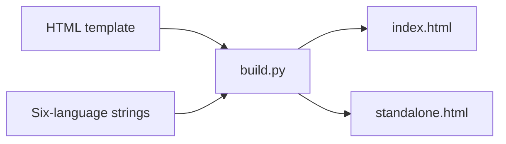

# Respire Prototype: Lumina V3

Alternative static layout with dark navigation, warm accents, and layered memory cards. This independent prototype does not replace the current React website.



## Build and preview

Use Python 3; no npm installation is needed in this directory.

```sh
python3 build.py
python3 -m http.server 4184 --bind 127.0.0.1
```

Open the local HTTP URL. Edit templates and resources, then regenerate the entry and standalone bundle.

| File | Purpose |
| --- | --- |
| `index.template.html` | Structural and text source |
| `translations.tsv` | Chinese, English, Spanish, French, Korean, and Japanese text |
| `prompts.js` | Localized installation prompts |
| `config.js` | Configured destinations; null entries show an unavailable-link dialog |
| `main.js`, `i18n.js` | Preview interactions and language switching |
| `styles.css`, `assets/` | Styling and original brand assets |
| `preview/` | Preserved English and Chinese client demonstration snapshots |
| `build.py` | Default-English page, locale data, and standalone generation |

English is the default. The `lang` query parameter preserves Chinese, Spanish, French, Korean, or Japanese selection. Client demonstrations have English and Chinese interfaces; other page languages use the English demonstration.

## Scope

Configured release destinations are links, not proof that installers have been published or verified. The prototype includes no account backend, cryptography implementation, synchronization engine, or benchmark results. Original brand and client-preview resource notices remain unchanged.
